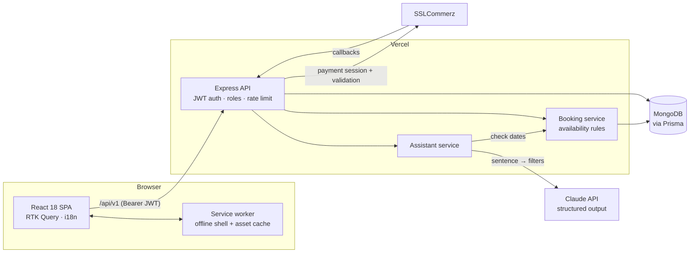

# BEHB · Hotel Booking for Bangladesh

[](https://github.com/ahad30/hotel-booking/actions/workflows/ci.yml)
-95%20%7C%20100%20%7C%20100%20%7C%20100-success)


A full-stack hotel booking platform for Bangladesh. Guests browse hotels by **division → district → area**, check room availability, book rooms and pay online through **SSLCommerz**. Admins manage hotels, rooms, locations, bookings, users, homepage sliders and notifications from a dashboard.

- **Live site:** https://behb-hotel-booking.vercel.app
- **API docs:** https://hotel-booking-server-theta.vercel.app/api-docs
- **Try it:** the [read-only demo admin](#demo-admin-login), or ask the trip assistant on the home page for *"Family of 4 in Chattogram under ৳6,000 with a pool this weekend"*.

---

## Table of contents

- [What makes it different](#what-makes-it-different)
- [Architecture](#architecture)
- [Highlights](#highlights)
- [Features](#features)
- [Tech stack](#tech-stack)
- [Project structure](#project-structure)
- [Data model](#data-model)
- [API overview](#api-overview)
- [Client routes](#client-routes)
- [Getting started](#getting-started)
- [Environment variables](#environment-variables)
- [Scripts](#scripts)
- [Testing and CI](#testing-and-ci)
- [Deployment](#deployment)
- [Demo admin login](#demo-admin-login)

---

## What makes it different

### AI trip assistant
Describe the trip in a sentence and get bookable rooms back:

> *"Couple in Sylhet, 3 nights from 12 Oct, with spa"*

1. `POST /api/v1/assistant/search` sends the sentence to **Claude** with a strict JSON schema (structured output). The schema only allows the divisions and amenities that exist in the database, so the model can't invent filters.
2. The server matches real hotels, then runs the **same availability check as checkout** for the dates, so every result can really be booked.
3. The UI shows *"We understood"* chips (place, budget, guests, dates, amenities) so the person can see how the request was read, and each result links to the hotel with the dates filled in.

It is built to fail safely: when no `ANTHROPIC_API_KEY` is set, or Claude errors, times out or declines, a **deterministic rule-based parser** (`server/src/services/Assistant/ruleParser.js`, unit-tested) handles the request instead. The endpoint is rate-limited per IP (8 requests per minute).

### Availability heatmap calendar
Each hotel page shows the next 8 weeks as a calendar coloured by **how many rooms are free each night**, filterable by room type. Fully booked nights are hatched. Tap a check-in date and then a check-out date to set the stay. It is served by `GET /hotel/:id/availability`, which counts nights with the same `bookedQuantity` rules as checkout, so the calendar and checkout never disagree.

### English / বাংলা
A language switch in the navbar translates the public site into Bangla (with the Hind Siliguri font and looser line heights for Bangla script). The choice is saved, and `<html lang>` is updated for screen readers and search engines. Translations live in `client/src/i18n/dictionary.js`.

### Installable PWA that works offline
A web app manifest, icons and a hand-written service worker (`client/public/sw.js`):
- **Pages:** network first, so new deploys show up straight away. Offline, the cached app shell loads, and pages you've opened before still work.
- **Build files** (`/assets/*`, content-hashed): cache first.
- **Photos and fonts:** served from cache and refreshed in the background, capped at 80 entries.
- **The API is never cached**, so prices and availability are always live.
- A page that hasn't been downloaded yet shows a clear *"You're offline"* screen instead of a 404.

### Tested, with CI on every push
Unit tests for the server, Playwright end-to-end tests for the main user journeys on desktop and mobile, and a GitHub Actions pipeline. See [Testing and CI](#testing-and-ci).

---

## Architecture



**Design decisions**
- **One availability rule, used everywhere.** Checkout, the calendar and the assistant all count booked rooms with `BookingService.bookedQuantity`, so they always agree. Unpaid checkouts hold their rooms for 30 minutes.
- **Use the LLM for understanding, not for data.** Claude only turns the sentence into filters, and the database decides the results. This keeps answers grounded, cheap (low effort, a small JSON output) and testable.
- **Payments are trusted only once verified.** SSLCommerz callbacks are re-validated with the gateway (status, transaction ID and amount) before a booking is marked paid.
- **Fast first screen on slow phones.** Routes are code-split, and the home page builds only the first screen up front, mounting later sections when they scroll near or the browser is idle (`components/ui/Deferred.jsx`).

---

## Highlights

### Design
- A custom Tailwind design system: the Plus Jakarta Sans font, a brand palette taken from the BEHB logo gradient, and shared buttons, cards, chips and skeleton loaders (`client/src/components/ui/`).
- Fully responsive: a transparent navbar over the hero photo on desktop, and a floating tab bar plus bottom booking bar on phones.
- Accessible details: keyboard-friendly modals and photo viewer (Escape and arrow keys), visible focus rings, ARIA labels, and support for reduced-motion settings.

### Security
- **JWT authentication** on every private endpoint, with role-based access: admin-only management routes, and "self or admin" for a user's own profile, bookings and notifications.
- **No secrets in responses or code:** password hashes are never returned, credentials live in environment variables (see `server/.env.example`), and public sign-up cannot create admin accounts.
- **Payments are verified server-side:** SSLCommerz callbacks are confirmed with the SSLCommerz validation API (status, transaction ID and amount) before a booking is marked paid.
- **Availability is re-checked at checkout**, per room type and quantity, before the customer is sent to payment.
- **Read-only demo admin** (`DEMO_ADMIN_PHONE`) so the public demo can't change live data.

### Performance
Lighthouse 12 on a local production build of the home page:

| | Performance | Accessibility | Best practices | SEO |
|---|---|---|---|---|
| Desktop | 95 | 100 | 100 | 100 |
| Mobile (simulated slow 4G, 4× CPU slowdown) | 56 | 100 | 100 | 100 |

Desktop LCP is 1.3 s with CLS 0.001. On mobile, the remaining cost is the client-side rendered React app on a throttled CPU. Deferring below-the-fold sections cut total blocking time from 870 ms to about 560 ms. Server-side rendering is the next step.

Download size, measured on the production build of the home page:

| Home page download | Before redesign | After |
|---|---|---|
| JavaScript | 4.4 MB (1.34 MB gzipped) | 438 KB (133 KB gzipped) |
| CSS | 264 KB | 63 KB (11 KB gzipped) |

How:
- **Route-level code splitting** with `React.lazy`: the admin dashboard, PDF export, rich-text editor and date picker download only on the pages that use them.
- **Vendor chunks** (`react-vendor`, `state-vendor`) that browsers can keep cached between deploys.
- **Preloading** of the font and the hero image from `index.html`; every other image is lazy-loaded, decoded off the main thread and faded in once ready.
- **Lightweight components:** CSS scroll-snap carousels and hand-built modals instead of carousel and UI-kit libraries on the public pages, and a debounced hotel search so the API isn't called on every keystroke.

---

## Features

### Guests / customers
- **AI trip assistant**: describe a trip in plain English and get rooms that are really available
- Search hotels by name, division and district from the home page, with grid or list view and live "from ৳X / night" prices
- **Availability heatmap calendar** on every hotel page
- Save hotels, compare up to 3 side by side, and see recently viewed hotels
- **English / Bangla** language switch
- Install the site as an app (PWA), with an offline fallback
- Browse hotels by location (division → district → area → hotels)
- Hotel page with a photo gallery and full-screen viewer, amenities, map, and room cards with room, adult and child counts
- Check room availability for chosen check-in and check-out dates (changing dates clears selected rooms so availability is re-checked)
- Book multiple rooms in one checkout and pay through SSLCommerz (BDT)
- Pages shown after a successful, failed or cancelled payment
- Register and log in, with email verification through a token link (`/verify/:token`)
- Customer dashboard to see booking history and view a booking (can be printed or exported to PDF), edit the profile and change the password
- In-app notifications, such as booking confirmations

### Admins
- One login page for everyone: admins land in the role-protected admin dashboard, and customers go back to where they were
- Dashboard statistics
- CRUD for **hotels**, **rooms**, **areas**, **homepage sliders** and **users**
- View and edit bookings
- Send notifications, and view contact messages and subscriptions
- Image uploads through the ImgBB API, and rich-text descriptions through CKEditor

---

## Tech stack

| Layer | Technology |
|---|---|
| **Frontend** | React 18, Vite 4 (SWC), React Router 6 |
| **State / data fetching** | Redux Toolkit, RTK Query, redux-persist |
| **UI** | Tailwind CSS (custom design system), React Icons (Lucide set), Ant Design (form fields and admin tables), Material Tailwind and Headless UI (dashboard) |
| **Forms** | React Hook Form, CKEditor 5 |
| **Dates** | react-datepicker, date-fns, Moment |
| **PDF** | @react-pdf/renderer (booking receipts) |
| **Notifications** | Sonner toasts |
| **Backend** | Node.js, Express 4 |
| **Database / ORM** | MongoDB with Prisma 6 |
| **Auth** | bcryptjs (password hashing), jsonwebtoken (JWT) |
| **Payments** | SSLCommerz (`sslcommerz-lts`) |
| **AI** | Claude through `@anthropic-ai/sdk` (structured JSON output), with a rule-based fallback |
| **Testing** | Node's built-in test runner (server), Playwright (end to end), GitHub Actions |
| **PWA** | Web app manifest and a hand-written service worker |
| **Email** | Nodemailer |
| **API docs** | swagger-jsdoc, swagger-ui-express |
| **Hosting** | Vercel (client and server), Netlify (client mirror) |

---

## Project structure

The repo has two separate apps: `client/` (React SPA) and `server/` (Express API).

```
Hotel_Booking/
├── client/                         # React + Vite frontend
│   ├── public/_redirects           # SPA fallback for Netlify
│   ├── vercel.json                 # SPA rewrites for Vercel
│   ├── index.html                  # SEO/Open Graph tags, font + hero image preloads
│   ├── vite.config.js              # Vendor chunk splitting
│   ├── tailwind.config.js          # Design tokens: brand/ink colours, shadows, animations
│   └── src/
│       ├── main.jsx                # App entry: Redux Provider, PersistGate, Toaster
│       ├── App.jsx                 # RouterProvider
│       ├── index.css               # Base styles and shared classes (btn, card, chip, skeleton)
│       ├── Routes/
│       │   ├── routes.jsx                  # Top-level router; every page except Home is lazy-loaded
│       │   ├── Admin.Routes.jsx            # Admin dashboard routes + sidebar items
│       │   ├── Customer.Routes.jsx         # Customer dashboard routes
│       │   ├── AdminPanelProtectedRoutes/  # Allows only users with role === "admin"
│       │   └── UserProtectedRoutes/        # Allows only logged-in users
│       ├── Layouts/
│       │   ├── Home/MainLayout.jsx         # Public layout: navbar, footer, mobile tab bar, search context
│       │   └── Dashboard/                  # Admin & customer dashboard layouts, sidebars, navbars
│       ├── Pages/
│       │   ├── Home/
│       │   │   ├── Hero/                   # Hero section and search panel (name, division, district)
│       │   │   ├── AllHotel/               # Hotel grid/list with filters; hotels by area
│       │   │   ├── BannerSlider/           # Offers carousel (CSS scroll-snap)
│       │   │   ├── Destinations/           # Division photo grid
│       │   │   ├── WhyUs/                  # Features and "how it works"
│       │   │   └── HotelDetails/           # Gallery + lightbox, room cards, booking summary, date picker
│       │   ├── Division/ District/ Area/   # Step-by-step browsing by location
│       │   ├── Checkout/ Success/ Error/   # Booking and payment flow
│       │   ├── Auth/                       # Shared AuthShell layout; Login, Register, AdminLogin
│       │   ├── Verify/                     # Email verification
│       │   ├── Notification/ PrivacyPolicy/
│       │   └── Dashboard/
│       │       ├── Admin/                  # Hotel, Room, Area, Bookings, Customers, Slider,
│       │       │                           # AddNotification, Contact, Subscription, Statistics, Profile
│       │       └── User/                   # BookingHistory, EditProfile, ChangePassword
│       ├── components/
│       │   ├── ui/                         # Design-system components: HotelCard, SmartImage, Modal,
│       │   │                               # Stepper, PlaceList, Logo, PageLoader, amenity icons
│       │   ├── Form/                       # Reusable "Z*" form inputs (ZFormTwo, ZInputTwo, ZSelect, ZImageInput, ...)
│       │   ├── Modal/                      # Admin Add / Edit / View / Delete modals
│       │   ├── Table/DashboardTable.jsx    # Shared antd table for admin lists
│       │   └── Skeleton/ BreadCrumb/ Button/ ...
│       ├── common/                         # Navbar, mobile tab bar, Footer, 404 page
│       ├── redux/
│       │   ├── store/store.js              # Store config (persists auth and booking)
│       │   ├── Api/baseApi.js              # RTK Query base (VITE_BACKEND_URL + Bearer token)
│       │   ├── Feature/Admin/*/            # Endpoints per resource (hotel, room, booking, area, ...)
│       │   ├── Feature/User/               # Customer and location endpoints
│       │   ├── Feature/auth/               # Auth API and slice
│       │   ├── Booking/ Modal/ loading/    # Local UI slices
│       │   └── Hook/Hook.jsx               # Typed useAppDispatch / useAppSelector
│       └── utils/                          # Price formatting, routesGenerator, sidebarGenerator, error helpers
│
└── server/                         # Express + Prisma backend
    ├── index.js                    # App entry: CORS, JSON, Swagger, /api/v1 router, DB connect
    ├── vercel.json                 # Vercel serverless config
    ├── prisma/schema.prisma        # MongoDB data model
    └── src/
        ├── routes/index.js         # All REST routes, wired to controllers
        ├── controllers/            # HTTP layer (request → service → response)
        ├── services/               # Business logic and Prisma queries, grouped by domain
        │   ├── Authentication/ User/ Admin/
        │   ├── Hotel/ Room/ Booking/
        │   ├── Division/ District/ Area/
        │   ├── Slider/ Notification/
        │   └── PaymentGateway/     # SSLCommerz integration
        ├── config/                 # dotenv helper, Swagger config
        ├── shared/                 # catchAsync, response handler, email utility
        ├── utility/                # Bcrypt password hasher
        └── error/                  # API error handling

e2e/                                # Playwright tests (mocked API, desktop + mobile)
.github/workflows/ci.yml            # Lint, build, unit tests, end-to-end tests
```

Also new: `client/src/i18n/` (English/Bangla dictionary and provider), `client/src/Pages/Home/Assistant/` (trip assistant UI), `client/public/sw.js` + `manifest.webmanifest` (PWA), `server/src/services/Assistant/` (Claude + rule-based parser), `server/src/middleware/rateLimit.js`, `server/test/` and `server/prisma/seed-bangladesh.js`.

### Backend architecture

The server uses a **controller → service** pattern:

1. `src/routes/index.js` defines each endpoint and passes it to a controller.
2. **Controllers** read the request, call a service and format the response.
3. **Services** hold the business logic and talk to MongoDB through the Prisma client.

For example, creating a booking starts an SSLCommerz payment session, saves the `Booking` with its transaction ID, creates a `Payment` record and sends the user a `BOOKING_CONFIRMATION` notification.

---

## Data model

Defined in [`server/prisma/schema.prisma`](server/prisma/schema.prisma) (MongoDB):

| Model | Purpose |
|---|---|
| `User` | Customers and admins (`role: user \| admin`), with email verification fields |
| `Hotel` | Hotel profile, location (division / city / area IDs, latitude and longitude), amenities; has many `Room` |
| `Room` | Room type, price, capacity, child count, quantity, images, amenities, availability |
| `Booking` | Guest details, booked items, check-in and check-out dates, total price, status, payment status, transaction ID |
| `Payment` | One per booking: gateway, amount, status, raw gateway response |
| `RoomBooking` | Links a booking to a room |
| `Division` / `District` / `Area` | Bangladesh location hierarchy, used for browsing |
| `Slider` | Homepage banner slides |
| `Notification` | Per-user notifications (booking confirmation, cancellation, promotion, …) |

---

## API overview

Every endpoint starts with **`/api/v1`**. Interactive docs are served at **`/api-docs`**.

| Resource | Endpoints |
|---|---|
| **Users / auth** | `POST /user/register`, `POST /user/login`, `GET /user`, `GET\|PUT\|DELETE /user/:id` |
| **Hotels** | `POST /hotel/create`, `GET /hotel`, `GET\|PUT\|DELETE /hotel/:id`, `GET /hotel/:divisionId/division`, `GET /hotel/:areaId/area` |
| **Rooms** | `POST /room/create`, `GET /room`, `GET\|PUT\|DELETE /room/:id`, `POST /room/checkAvailability`, `GET /hotel/:hotelId/rooms` |
| **Bookings** | `POST /booking/create`, `GET /booking`, `GET\|PUT\|DELETE /booking/:id`, `POST /booking/check-availability`, `GET /booking/user/:userId` |
| **Sliders** | `POST /sliders/create`, `GET /sliders`, `GET\|PUT\|DELETE /sliders/:id` |
| **Notifications** | `POST /notification/create`, `GET /notification/:userId`, `PUT /notification/:id/read` |
| **Assistant** | `POST /assistant/search` (rate-limited) |
| **Availability** | `GET /hotel/:hotelId/availability?from=YYYY-MM-DD&days=42` |
| **Divisions** | `POST /division/create`, `GET /division`, `GET\|PUT\|DELETE /division/:id` |
| **Districts** | `POST /district/create`, `GET /district`, `GET\|PUT\|DELETE /district/:id`, `GET /district/by-division/:id` |
| **Areas** | `POST /area/create`, `GET /area`, `GET\|PUT\|DELETE /area/:id`, `GET /area/by-district/:id` |

---

## Client routes

| Path | Page |
|---|---|
| `/` | Home: hero search, hotels, offers, destinations, features |
| `/division` → `/district/:divisionId` → `/area/:districtId` → `/hotel/:areaId` | Browse hotels by location |
| `/hotel-details/:id` | Hotel details, rooms and gallery |
| `/checkout`, `/success`, `/cancel` | Booking and payment flow |
| `/hotels`, `/compare`, `/saved`, `/contact` | Search with filters, side-by-side comparison, saved hotels, contact |
| `/login`, `/register`, `/verify/:token` | Sign-in (all roles) and sign-up |
| `/notification`, `/privacy-policy` | Misc |
| `/admin/*` | Admin dashboard (admins only) |
| `/user/user-profile`, `/user/user-booking` | Customer dashboard (logged-in users only) |

---

## Getting started

### Prerequisites
- Node.js 18+
- npm or pnpm (both lockfiles are committed)
- A MongoDB database (for example MongoDB Atlas). Prisma's MongoDB connector needs a **replica set**, which Atlas provides by default.
- An [ImgBB](https://api.imgbb.com/) API key for image uploads
- An SSLCommerz sandbox store for payments

### 1. Clone

```bash
git clone https://github.com/ahad30/hotel-booking.git
cd hotel-booking
```

### 2. Run the server

```bash
cd server
npm install          # also runs `prisma generate`
# create server/.env (see below)
npx prisma db push   # sync the schema to MongoDB
npm start            # nodemon index.js → http://localhost:5000
```

### 3. Run the client

```bash
cd client
npm install
# create client/.env (see below)
npm run dev          # http://localhost:5173
```

The server's CORS settings allow `http://localhost:5173` and `http://localhost:5174` in development.

---

## Environment variables

### `server/.env`

| Variable | Description |
|---|---|
| `DATABASE_URL` | MongoDB connection string used by Prisma |
| `PORT` | API port (default `5000`) |
| `SERVER_URL` | Public URL of the API, used for SSLCommerz callback URLs (default `http://localhost:5000`) |
| `CLIENT_URL` | Public URL of the client, where customers return after payment (default `http://localhost:5173`) |
| `JWT_SECRET` | **Required.** Long random string used to sign login tokens |
| `JWT_EXPIRES_IN` | Login token lifetime (default `7d`) |
| `DEMO_ADMIN_PHONE` | Optional. Phone number of a demo admin that can browse the dashboard but not change data |
| `SSLCOMMERZ_STORE_ID` | SSLCommerz store ID |
| `SSLCOMMERZ_STORE_PASSWORD` | SSLCommerz store password |
| `SSLCOMMERZ_IS_LIVE` | `true` for production, `false` for sandbox |
| `SMTP_HOST`, `SMTP_PORT`, `SMTP_USER`, `SMTP_PASS`, `EMAIL_FROM` | Optional. Mail server used for verification emails |
| `ANTHROPIC_API_KEY` | Optional. Enables Claude for the trip assistant. Without it, the rule-based parser is used |

Copy `server/.env.example` and `client/.env.example` to get started.

### `client/.env`

| Variable | Description |
|---|---|
| `VITE_BACKEND_URL` | API base URL, including the version prefix, e.g. `http://localhost:5000/api/v1` |
| `VITE_IMAGE_HOSTING_KEY` | ImgBB API key for image uploads |

`.env` files are git-ignored. Never commit them.

---

## Scripts

### Client (`client/`)
| Script | Description |
|---|---|
| `npm run dev` | Start the Vite dev server |
| `npm run build` | Production build into `dist/` |
| `npm run preview` | Preview the production build |
| `npm run lint` | Run ESLint |

### Server (`server/`)
| Script | Description |
|---|---|
| `npm start` | Start the API with nodemon |
| `npm run prisma:push` | Push the Prisma schema to the database |
| `npm run vercel-build` | Run `prisma generate` (used by Vercel) |
| `npm test` | Run the unit tests |
| `npm run seed:bd` | Add demo hotels and rooms across all 8 divisions of Bangladesh |

### End-to-end tests (`e2e/`)
| Script | Description |
|---|---|
| `npm test` | Build the client and run the Playwright tests (set `PW_CHANNEL=chrome` to use an installed Chrome) |
| `npm run report` | Open the last HTML report |

---

## Testing and CI

**Server unit tests** (`server/test/`, `node --test`, no extra dependencies):
- JWT middleware: a missing, forged or expired token is rejected, roles are enforced, the demo admin is read-only, and owner-or-admin checks work
- Rate limiter: limits per client, `Retry-After` header, window reset
- Trip parser: places and their aliases, budgets (`under 6k`, `between 2k and 5k`), guests (`family of 4`, `couple`), Bangladesh's Friday–Saturday weekend, explicit dates and night counts
- Booking quantity rules, including older bookings saved before quantities existed

**End-to-end tests** (`e2e/`, Playwright, desktop Chrome and Pixel 7). They run against a real production build with the API mocked from fixtures, so they're fast and repeatable:
- Home page → hotel page
- Switching to Bangla, and the choice surviving a reload
- Trip assistant: what it understood, and the booking link with dates
- Hotel page: a fully booked night on the calendar, choosing a room, and Reserve asking a guest to log in
- Comparing two hotels
- PWA: the manifest and icons are served, and the app works offline
- No sideways scrolling on key pages, on phone and desktop

**GitHub Actions** (`.github/workflows/ci.yml`) runs three jobs on every push and pull request: client lint + build, server tests, and Playwright (with the HTML report uploaded when a test fails).

---

## Deployment

Both apps deploy automatically on **Vercel** from this GitHub repo, as two projects with their Root Directory set to `client` and `server`:

- A push to **`main`** deploys both apps to production.
- A push to any other branch (such as `dev`) creates **preview** deployments with their own URLs.
- An app is skipped when its folder didn't change in the push (Ignored Build Step: `git diff HEAD^ HEAD --quiet -- .`).

Per app:

- **Client**: `client/vercel.json` sends every path to the SPA so React Router can handle it. `client/public/_redirects` does the same for Netlify.
- **Server**: `server/vercel.json` runs `index.js` through `@vercel/node` and generates the Prisma client during the build.

Set the environment variables above in each Vercel project. Add the deployed client URL to the CORS `origin` list in `server/index.js`.

---

## Demo admin login

Sign in at [behb-hotel-booking.vercel.app/login](https://behb-hotel-booking.vercel.app/login) to explore the admin dashboard:

| Role | Phone | Password |
|---|---|---|
| Admin (read-only demo) | `01000000000` | `Demo@1234` |

This account can open every dashboard page, but the API refuses any change it tries to make, so the live data stays intact.
