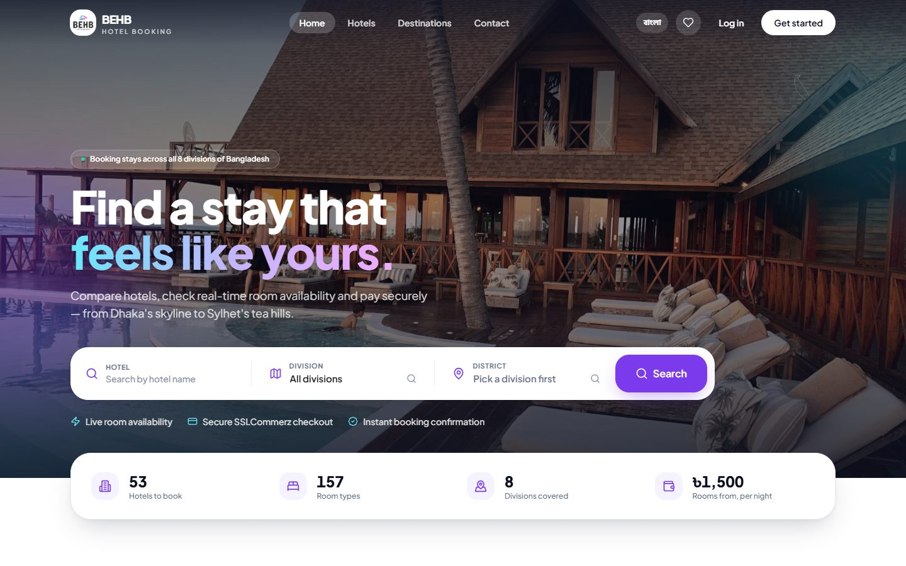
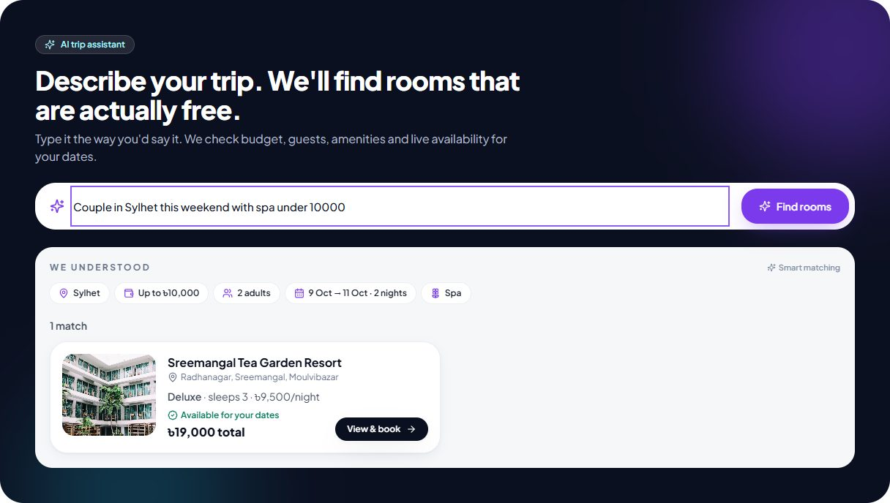
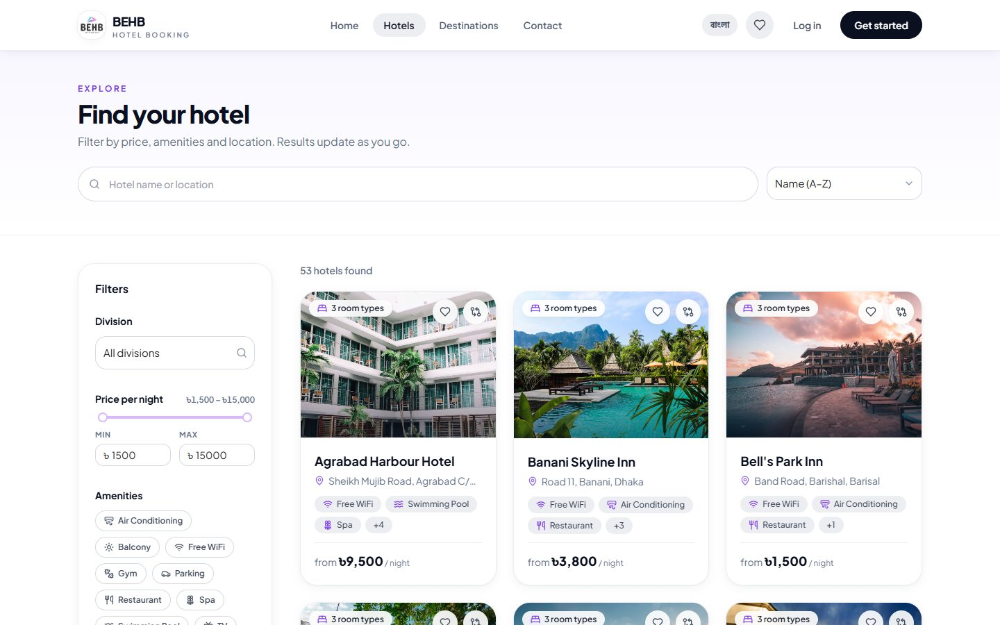
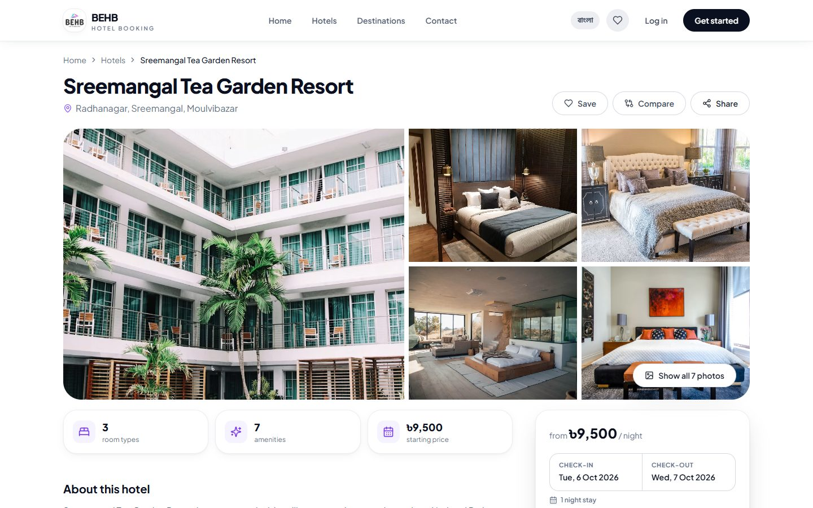
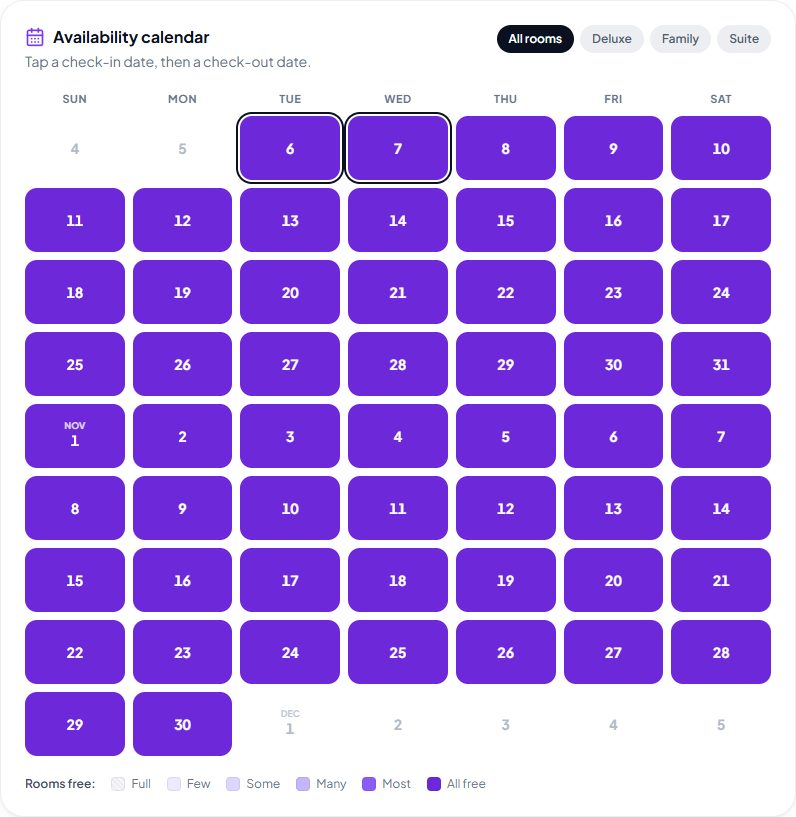
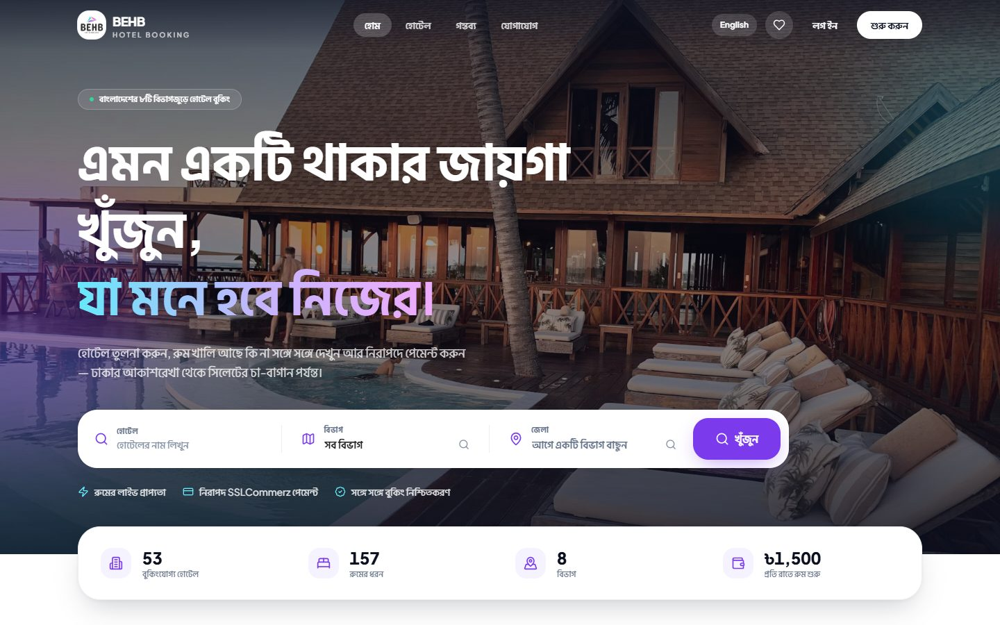
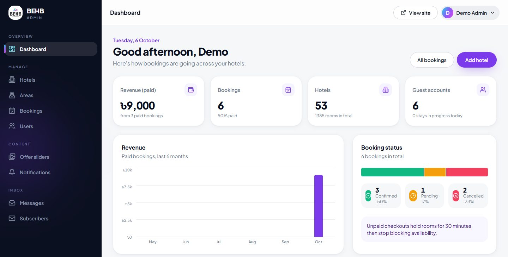
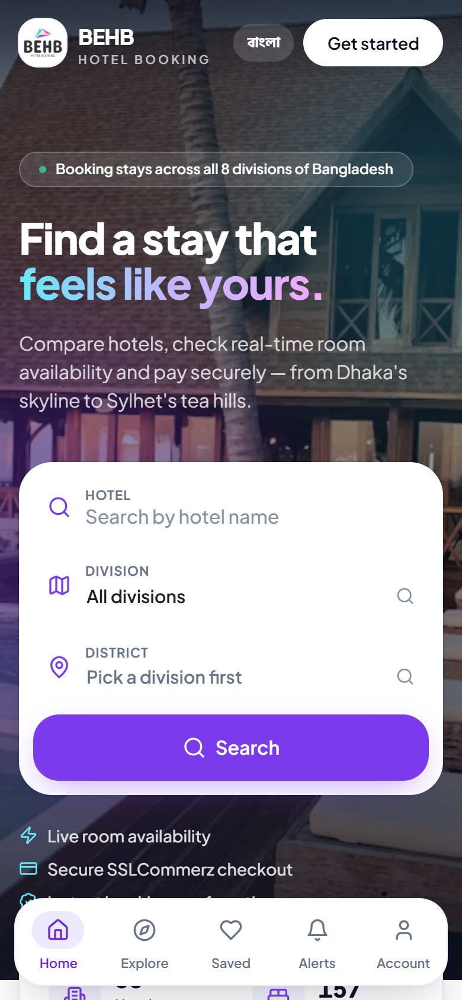
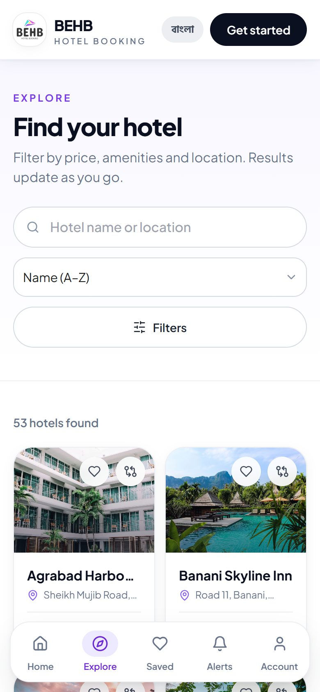
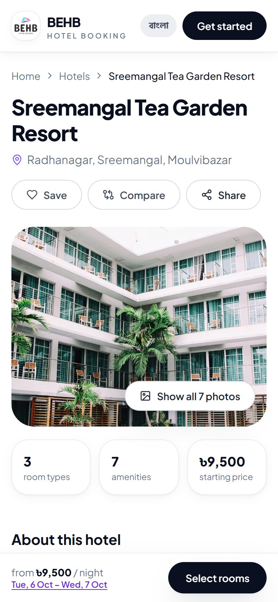

# BEHB · Hotel Booking for Bangladesh

[](https://github.com/ahad30/hotel-booking/actions/workflows/ci.yml)
-95%20%7C%20100%20%7C%20100%20%7C%20100-success)


A full-stack hotel booking app for Bangladesh. Find hotels across all 8 divisions, check live room availability, and pay online with SSLCommerz. Admins manage everything from a dashboard.

**Live site:** https://behb-hotel-booking.vercel.app



---

## Features

- **AI trip assistant:** type something like *"Family of 4 in Chattogram under ৳6,000 with a pool this weekend"* and get rooms that are really free for those dates. It uses Claude, with a rule-based fallback.
- **Availability calendar:** an 8-week heatmap of free rooms per night. Tap two dates to set your stay.
- **English / বাংলা** language switch.
- **Search and explore:** filters, sorting, infinite scroll, saved hotels and side-by-side comparison.
- **Booking and payments:** book several rooms at once and pay through SSLCommerz, verified on the server.
- **Installable PWA:** works offline for pages you've already opened.
- **Secure API:** JWT login, role-based access, rate limiting and a read-only demo admin.
- **Admin dashboard:** manage hotels, rooms, locations, bookings, users, sliders and notifications.

## Screenshots

**AI trip assistant**: describe the trip and get rooms that are free for your dates.



| Explore hotels | Hotel page |
|---|---|
|  |  |
| **Availability calendar** | **বাংলা (Bangla)** |
|  |  |

**Admin dashboard**



**On mobile**

<p>
  
  
  
</p>

## Tech stack

| | |
|---|---|
| **Frontend** | React 18, Vite, React Router, Redux Toolkit (RTK Query), Tailwind CSS, Ant Design |
| **Backend** | Node.js, Express, Prisma, MongoDB |
| **Other** | JWT, SSLCommerz, Claude API, Playwright, GitHub Actions, Vercel |

## Getting started

You need Node.js 18+ and a MongoDB database (MongoDB Atlas works).

```bash
git clone https://github.com/ahad30/hotel-booking.git
cd hotel-booking
```

**Server** (http://localhost:5000):

```bash
cd server
cp .env.example .env    # fill in the values
npm install
npx prisma db push
npm run seed:bd         # optional: adds demo hotels across Bangladesh
npm start
```

**Client** (http://localhost:5173):

```bash
cd client
cp .env.example .env    # set VITE_BACKEND_URL=http://localhost:5000/api/v1
npm install
npm run dev
```

### Environment variables

| Server (`server/.env`) | |
|---|---|
| `DATABASE_URL` | MongoDB connection string |
| `JWT_SECRET` | Long random string for login tokens |
| `SSLCOMMERZ_STORE_ID`, `SSLCOMMERZ_STORE_PASSWORD` | Payment gateway (use sandbox values for testing) |
| `ANTHROPIC_API_KEY` | Optional. Turns on Claude for the trip assistant |
| `DEMO_ADMIN_PHONE` | Optional. Makes that admin account read-only |

| Client (`client/.env`) | |
|---|---|
| `VITE_BACKEND_URL` | API URL, e.g. `http://localhost:5000/api/v1` |
| `VITE_IMAGE_HOSTING_KEY` | ImgBB key for image uploads |

The `.env.example` files list the rest.

## Tests

```bash
cd server && npm test   # unit tests: auth, rate limit, trip parser, booking rules
cd e2e && npm install && npm test   # Playwright end-to-end tests, desktop and mobile
```

GitHub Actions runs lint, build and both test suites on every push.

## Performance

Lighthouse on the home page:

| | Performance | Accessibility | Best practices | SEO |
|---|---|---|---|---|
| Desktop | 95 | 100 | 100 | 100 |
| Mobile | 56 | 100 | 100 | 100 |

Code splitting cut the home page's JavaScript from 4.4 MB to 438 KB.

## Project structure

```
hotel-booking/
├── client/                    # React + Vite frontend
│   ├── public/                # Icons, PWA manifest, service worker, offline page
│   └── src/
│       ├── Pages/             # Home, Hotels, HotelDetails, Compare, Saved, Checkout,
│       │                      # Auth, Dashboard (admin + user), Notification, ...
│       ├── components/ui/     # Shared UI: HotelCard, Modal, Stepper, SmartImage, ...
│       ├── common/            # Navbar, mobile tab bar, footer, error page
│       ├── Layouts/           # Public and dashboard layouts
│       ├── Routes/            # Routes and role-based route guards
│       ├── redux/             # Store and RTK Query API endpoints
│       ├── i18n/              # English / Bangla translations
│       └── utils/             # Helpers (price format, local collections, ...)
│
├── server/                    # Express + Prisma backend
│   ├── index.js               # App entry (CORS, JSON, routes)
│   ├── prisma/
│   │   ├── schema.prisma      # MongoDB data model
│   │   └── seed-bangladesh.js # Demo hotels across all 8 divisions
│   ├── src/
│   │   ├── routes/            # All /api/v1 endpoints
│   │   ├── controllers/       # Request → service → response
│   │   ├── services/          # Business logic: Hotel, Room, Booking, Assistant,
│   │   │                      # PaymentGateway, User, Notification, ...
│   │   ├── middleware/        # JWT auth, roles, rate limit
│   │   └── config/ shared/    # Env config and helpers
│   └── test/                  # Unit tests (node --test)
│
├── e2e/                       # Playwright end-to-end tests
├── docs/screenshots/          # Images used in this README
└── .github/workflows/ci.yml   # CI: lint, build and tests
```

## Deployment

Both apps deploy to Vercel automatically: pushing to `main` updates production, and other branches get preview links.

## Demo admin login

Sign in at [behb-hotel-booking.vercel.app/login](https://behb-hotel-booking.vercel.app/login):

| Phone | Password |
|---|---|
| `01000000000` | `Demo@1234` |

This account is read-only, so you can look around the dashboard without changing any data.
